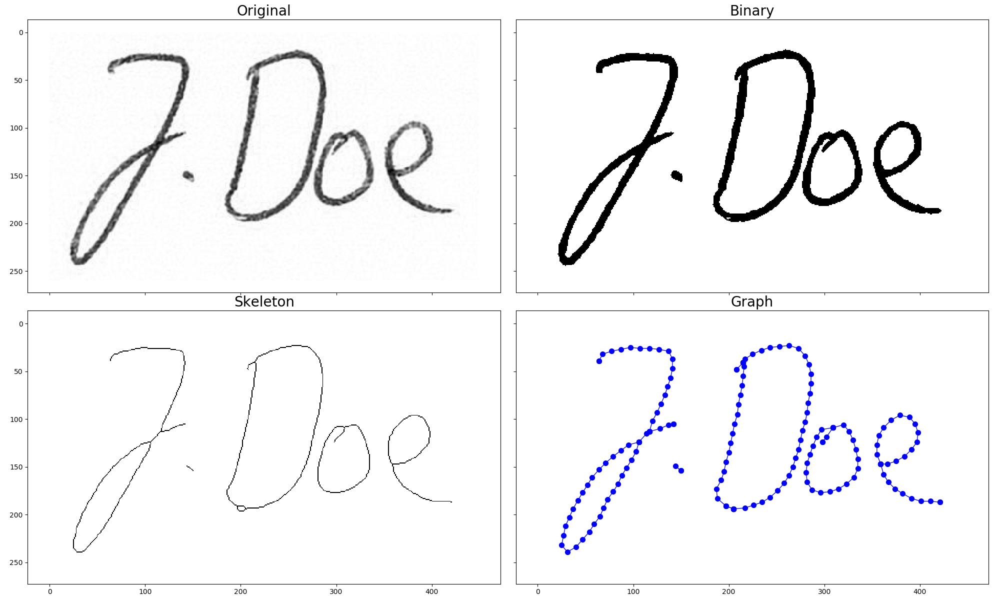

# SkeletonGraph

## install conda environment
```conda env create -f environment.yml```

## run.py parameters
```
python run.py -h
usage: run.py [-h] -i INPUT [-d] [-o OUTPUT]

Skeleton Graph Example

optional arguments:
  -h, --help            show this help message and exit
  -i INPUT, --input INPUT
                        Path to input image
  -d, --display         Display output (default: False)
  -o OUTPUT, --output OUTPUT
                        Path to output file
```

## example run
### command:
```python run.py -i example_images/JDoe1.png -d -o example_output/JDoe1.png.gxl```

### output gxl-file (-o, --output)
gxl-file: [example_output/JDoe1.png.gxl](example_output/JDoe1.png.gxl)

### output display (-d, --display)



## Publications
This implementation of skeleton graphs or keypoint graphs<sup>1</sup> have been use in the following publications: 

* P. Maergner, K. Riesen, R. Ingold, and A. Fischer (Apr. 2020). **“Signature Verification via Graph-Based Methods”**. In: Handbook of Pattern Recognition and Computer Vision. Ed. by C. H. Chen. World Scientific, pp. 305–322.
  [[World Scientific]](https://www.worldscientific.com/doi/10.1142/9789811211072_0016)
  
* P. Maergner, N. Howe, K. Riesen, R. Ingold, and A. Fischer (June 2019). **“Graph-Based Offline Signature Verification”**. In: arXiv:1906.10401 [cs]. arXiv:1906.10401 [cs].
  [[arXiv]](https://arxiv.org/abs/1906.10401)
  
* P. Maergner, V. Pondenkandath, M. Alberti, M. Liwicki, K. Riesen, R. Ingold, and A. Fischer (July 2019). **“Combining Graph Edit Distance and Triplet Networks for Offline Signature Verification”**. In: Pattern Recognition Letters 125, pp. 527–533.
  [[ScienceDirect]](https://www.sciencedirect.com/science/article/abs/pii/S0167865519301850)
  
* M. Stauffer, P. Maergner, A. Fischer, R. Ingold, and K. Riesen (2019). **“Offline Signature Verification using Structural Dynamic Time Warping”**. In: Proc. of Int. Conf. on Document Analysis and Recognition (ICDAR). IEEE, pp. 1117–1124.
  [[IEEE Xplore]](https://ieeexplore.ieee.org/abstract/document/8978181)
  
* P. Maergner, N. Howe, K. Riesen, R. Ingold, and A. Fischer (2018). **“Offline Signature Verification via Structural Methods: Graph Edit Distance and Inkball Models”**. In: Proc. of Int. Conf. on Frontiers in Handwriting Recognition (ICFHR), pp. 163–168.
  [[IEEE Xplore]](https://ieeexplore.ieee.org/document/8563244)
  
* P. Maergner, V. Pondenkandath, M. Alberti, M. Liwicki, K. Riesen, R. Ingold, and A. Fischer (2018). **“Offline Signature Verification by Combining Graph Edit Distance and Triplet Networks”**. In: Structural, Syntactic, and Statistical Pattern Recognition, pp. 470–480.
  [[Springer]](https://link.springer.com/chapter/10.1007%2F978-3-319-97785-0_45)
  [[arXiv]](https://arxiv.org/abs/1810.07491)
  
* P. Maergner, K. Riesen, R. Ingold, and A. Fischer (2017a). **“A Structural Approach to Offline Signature Verification Using Graph Edit Distance”**. In: Proc. of Int. Conf. on Document Analysis and Recognition (ICDAR). IEEE, pp. 1216–1222.
  [[IEEE Xplore]](https://ieeexplore.ieee.org/document/8270132)
  
* P. Maergner, K. Riesen, R. Ingold, and A. Fischer (June 2017b). **“Offline Signature Verification Based on Bipartite Approximation of Graph Edit Distance”**. In: Proc. of Int. Graphonomics Society Conference (IGS), pp. 162–165.


<sup>1</sup> Keypoint graph is another name for the same type of graph.